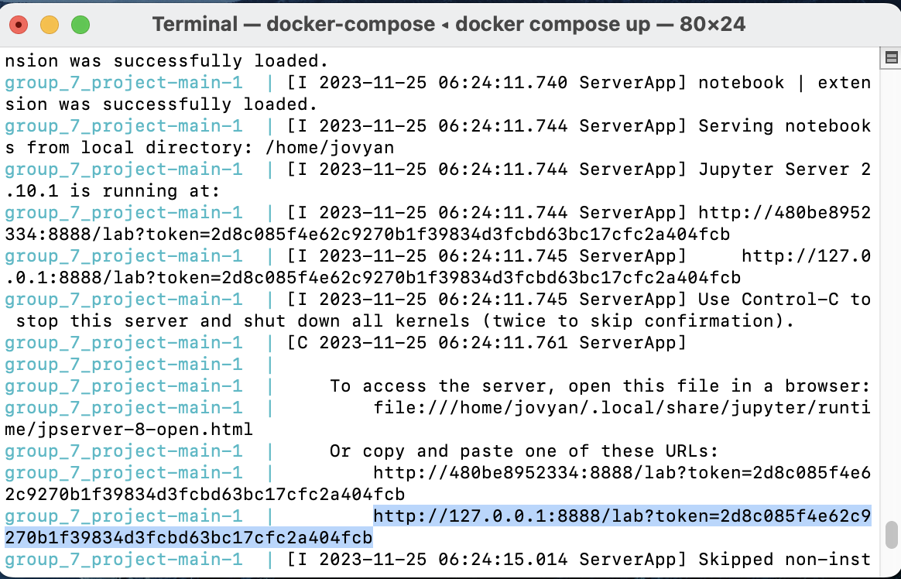

# Bank Marketing Prediction

-   Authors: Gretel Tan, Yan Zeng, Charles Xu, Riya E. Shaju

A data analysis project for DSCI 522 (Data Science workflows); a course in the Master of Data Science program at the University of British Columbia.

## About

In this project, we aimed to use customer information from a phone-call based direct marketing campaign of a Portuguese banking institution to predict whether customers would subscribe to the product offered, a term deposit. We applied several classification based models (k-NN, SVM, logistic regression and random forest) to our dataset to find the model which best fit our data, eventually settling on the random forest model, which performed the best among all the models tested, with an F-beta score with beta = 5 of 0.817, and an accuracy of 0.671 on the test data.

While this was the best performing model out of the models tested, its accuracy still left much to be desired. This indicates that perhaps more data is needed to accurately predict whether customers would subscribe to the term deposit. Future studies may also consider using more features, a different set of features which might be more relevant to whether customers will subscribe, or utilising feature engineering to obtain features which might be more useful in helping to predict whether customers would subscribe to the service.

## Report

The final report for the project may be viewed at this [link](https://ubc-mds.github.io/Group_7_Project/bank_marketing_prediction.html).

## Data Description

In this project, we utilized a dataset concerning direct marketing campaigns conducted by a Portuguese banking institution, as provided by Sérgio Moro, P. Rita, and P. Cortez in 2012 (Moro, S., Rita, P., and Cortez, P.). The dataset was sourced from UC Irvine's Machine Learning Repository and can be accessed via the following link: <https://archive.ics.uci.edu/dataset/222/bank+marketing>. Comprising 16 features and 45,211 instances, each row of the dataset corresponds to information about an individual client of the Portuguese bank. The primary objective of the dataset creators was to predict whether a client would subscribe to a term deposit, a target variable indicated by the 'y' column. In our analysis, we also utilized this column as our target variable.

The columns of this data are defined as below: \| Variable Name \| Role \| Type \| Demographic\| Description\| Units \| Missing Values \| \|:----:\|:--------:\|:---------:\|:----------:\|:------:\|:------:\|:------:\| \| age \| Feature \| Integer \|Age \| \| \| no \| \| job \| Feature \| Categorical \| Occupation \| type of job (categorical: 'admin.','blue-collar','entrepreneur','housemaid','management','retired','self-employed','services','student','technician','unemployed','unknown') \| \| no \| \| marital \| Feature \| Categorical \| Marital Status \| marital status (categorical: 'divorced','married','single','unknown'; note: 'divorced' means divorced or widowed) \| \| no \| \| education \| Feature \| Categorical \| Education Level \| (categorical: 'basic.4y','basic.6y','basic.9y','high.school','illiterate','professional.course','university.degree','unknown') \| \| no \| \| default \| Feature \| Binary \| \| has credit in default? \| \| no \| \| balance \| Feature \| Integer \| \| average yearly balance\| euros\| no \| \| housing \| Feature \| Binary \| \| has housing loan? \| \| no \| \| loan \| Feature \| Binary \| \| has personal loan?\| \| no \| \| contact \| Feature \| Categorical \| \|contact communication type (categorical: 'cellular','telephone') \| \| yes \| \| day_of_week \| Feature \| Date \| \| last contact day of the week \| \| no \| \| month \| Feature \| Date \| \| last contact month of year (categorical: 'jan', 'feb', 'mar', ..., 'nov', 'dec') \| \| no \| \| duration \| Feature \| Integer \| \| last contact duration, in seconds (numeric). Important note: this attribute highly affects the output target (e.g., if duration=0 then y='no'). Yet, the duration is not known before a call is performed. Also, after the end of the call y is obviously known. Thus, this input should only be included for benchmark purposes and should be discarded if the intention is to have a realistic predictive model. \| \| no \| \| campaign \| Feature \| Integer \| \| number of contacts performed during this campaign and for this client (numeric, includes last contact) \| \| no \| \| pdays \| Feature \| Integer \| \| number of days that passed by after the client was last contacted from a previous campaign (numeric; -1 means client was not previously contacted) \| \| yes \| \| previous \| Feature \| Integer \| \|number of contacts performed before this campaign and for this client \| \| no \| \| poutcome \| Feature \| Categorical \| \|outcome of the previous marketing campaign (categorical: 'failure','nonexistent','success') \| \| yes \| \| y \| Target \| Binary \| \| has the client subscribed a term deposit? \| \| no \|

## Usage

**Note:**

For this set up to run smoothly, you should have Docker installed and running on your computer. Download the appropriate Docker software for your machine [here](https://www.docker.com/get-started/), then proceed with the instructions below.

### Python, Git and Container Setup

1.  Setup your Python environment: e.g., Miniconda Python 3.11 [[Guide]](https://docs.conda.io/projects/conda/en/latest/user-guide/tasks/manage-environments.html)

2.  Clone the repository using this command in your terminal:

```         
git clone https://github.com/UBC-MDS/Group_7_Project.git
```

3.  Using the command line, change your directory into the root of this project's directory (using the cd command). Run the following command in that directory:

```         
docker compose up
```

4.  You should see a URL following the pattern [http://127.0.0.1:8888/lab?token=](http://127.0.0.1:8888/lab?token=2d8c085f4e62c9270b1f39834d3fcbd63bc17cfc2a404fcb) appear in the terminal window. For example, it might look like this: <http://127.0.0.1:8888/lab?token=2d8c085f4e62c9270b1f39834d3fcbd63bc17cfc2a404fcb> . Copy this from your terminal and paste the link into your preferred browser. This should open a Jupyter Lab browser containing the dependencies and documents used in our project. The relevant URL is highlighted in the screenshot below, for reference:



### Running the Analysis

To run the analysis:

1.  Open up a terminal in the Jupyter IDE of the Docker container, and use the terminal in the project root of the Docker container to navigate to the `work` directory using the command: `cd ./work`

2.  Use the command `make clean` in the terminal of the Docker container to remove all the files previously associated with this report - in other words, 'resetting' the project and allowing you to run it for yourself from scratch.

*Note: Sometimes, you might face the error: `bash: make: command not found` when trying to run this. If this happens, do not panic! Instead, open a new terminal on your computer (not the Docker container) and navigate to the root of this project's directory and run `docker pull riyashaju/group_7_project:latest`. This should update your Docker image of our container to the latest version, which includes the `make` package. Try step 2 again after doing this.*

3.  Then, use the command `make all` to re-run our analyses and regenerate our report. Our final rendered report html file should be located at `/docs/bank_marketing_prediction.html`.

### Cleaning Up the Container

1.  When you are done viewing the report and exploring our project, go back to the terminal window which is being used as the server to run the Docker container, and press the `Control + C` keys on your keyboard. This should stop the server and shut down all the kernels, and you should be able to type commands into the terminal again.

2.  Using the command line, type

```         
docker compose down
```

This should remove and clean up the container.

## Dependencies

Docker, a type of containerization software, was used to contain and run the dependencies required for this project. Detailed instructions on how to use the Docker image used in this project are found in the [Usage] section above. The Docker image used in this project was based on the `quay.io/jupyter/minimal-notebook:2023-11-19` image.

The dependencies contained in the project's Docker image are, in no particular order:

**Dependencies installed using conda:**

-   matplotlib=3.8.0

-   pandas=2.1.1

-   scikit-learn=1.3.1

-   bzip2=1.0.8

-   ca-certificates=2023.11.17

-   libexpat=2.5.0

-   libffi=3.4.2

-   libsqlite=3.44.0

-   libzlib=1.2.13

-   openssl=3.1.4

-   pip=23.3.1

-   pytest=7.4.3

-   python=3.11.6

-   setuptools=68.2.2

-   tk=8.6.13

-   tzdata=2023c

-   wheel=0.41.3

-   xz=5.2.6

-   click=8.1.7

-   jupyter-book=0.15.1

-   importlib-metadata=4.13.0

-   make=4.3

**Dependencies installed using pip:**

-   ucimlrepo==0.0.3

-   altair==5.1.2

-   vl-convert-python==1.2.0

-   vegafusion==1.4.5

-   vegafusion-jupyter==1.4.5

-   vegafusion-python-embed==1.4.5

More details on the exact dependencies contained in our Docker image can be found in our [Dockerfile](Dockerfile), located in the root of this project directory.

#### Running the tests

Tests are run using the `pytest` command in the root of the project.

## License

The Bank Marketing Prediction materials here are licensed under the Creative Commons Zero v1.0 Universal (CC0 1.0 Universal). The code is licensed under MIT License. If re-using/re-mixing please provide attribution and link to this webpage.

# References

If you find this project useful, please cite and refer to the original references:

-   Bauer, C. L., & Miglautsch, J. (1992). A conceptual definition of direct marketing. Journal of Direct Marketing, 6(2), 7--17. <https://doi.org/10.1002/dir.4000060204>
-   Harris, C.R. et al., 2020. Array programming with NumPy. Nature, 585, pp.357--362.
-   Hunter, J. D. (2007). Matplotlib: A 2D graphics environment. Computing in Science & Engineering, 9(3), 90--95.
-   McKinney, Wes. 2010. "Data Structures for Statistical Computing in Python." In Proceedings of the 9th Python in Science Conference, edited by Stéfan van der Walt and Jarrod Millman, 51--56.
-   Moro, S., Cortez, P., & Rita, P. (2014). A data-driven approach to predict the success of bank telemarketing. Decision Support Systems, 62, 22--31. <https://doi.org/10.1016/j.dss.2014.03.001>
-   Moro,S., Rita,P., and Cortez,P.. (2012). Bank Marketing. UCI Machine Learning Repository. <https://doi.org/10.24432/C5K306>.
-   Nowak, G. J., & Phelps, J. (1995). Direct marketing and the use of individual-level consumer information: Determining how and when "privacy" matters. Journal of Direct Marketing, 9(3), 46--60. <https://doi.org/10.1002/dir.4000090307>
-   Scikit-learn: Machine Learning in Python, Pedregosa et al., JMLR 12, pp. 2825-2830, 2011.
-   VanderPlas, J. et al., 2018. Altair: Interactive statistical visualizations for python. Journal of open source software, 3(32), p.1057.
-   Van Rossum, Guido, and Fred L. Drake. 2009. Python 3 Reference Manual. Scotts Valley, CA: CreateSpace.
